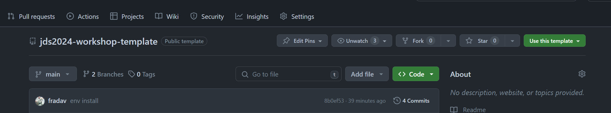
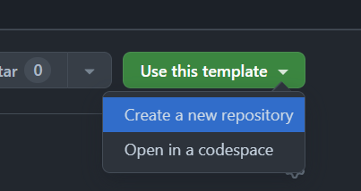
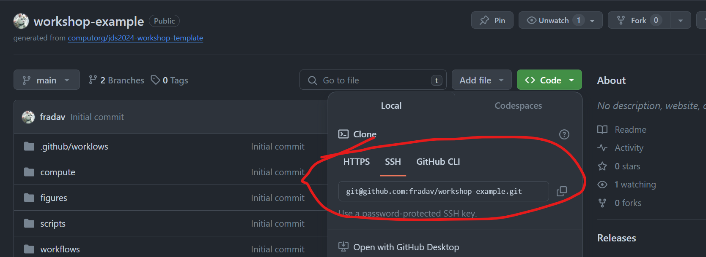
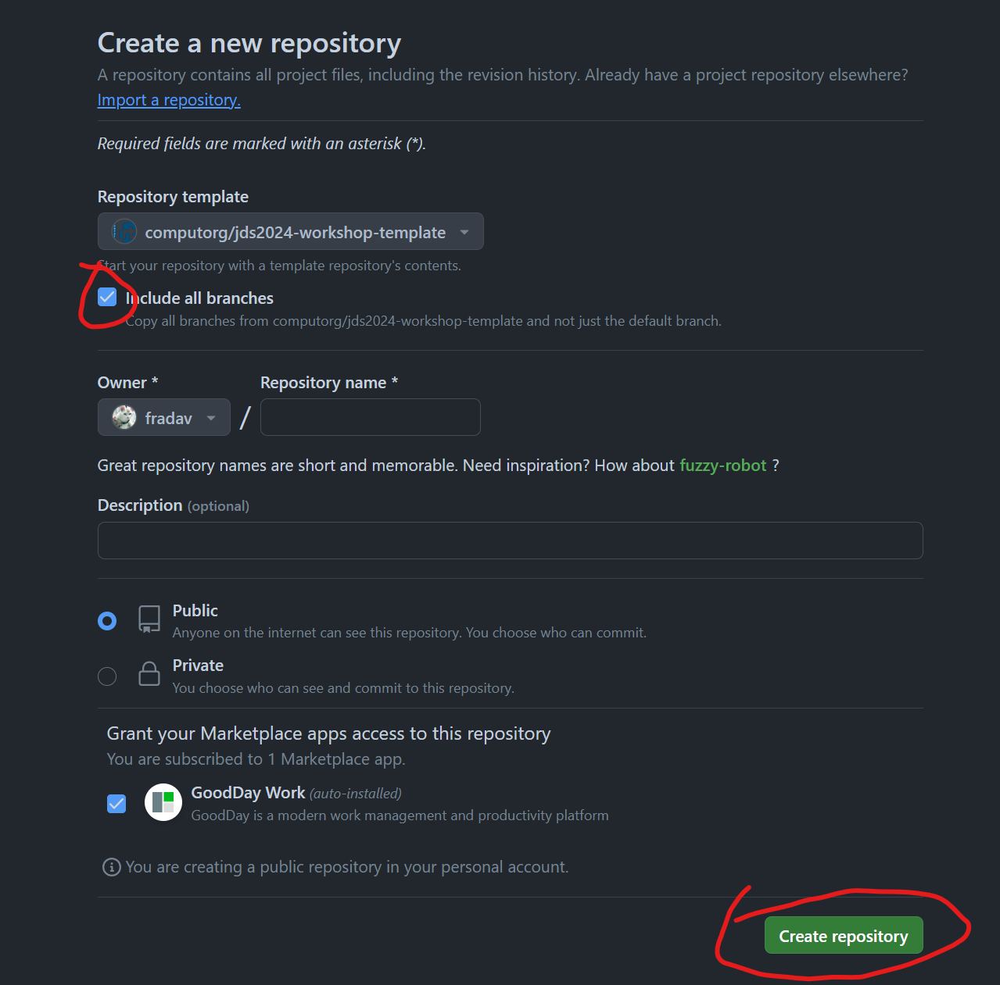

# jds2024-workshop-template

[Workshop site](https://computo.sfds.asso.fr/jds2024-workshop/) for the JDS 2024 workshop on reproducible research.

# Tempdate installation









# Environment installation

R
: 
```shell
Rscript -e 'install.packages("renv"); renv::restore()'
```

Python/pip
: 
```shell
pip install -r requirements.txt
```

Python/conda (we recommand [microconda](https://mamba.readthedocs.io/en/latest/installation/micromamba-installation.html))
: 
```shell
conda env create -f environment.yml
```
